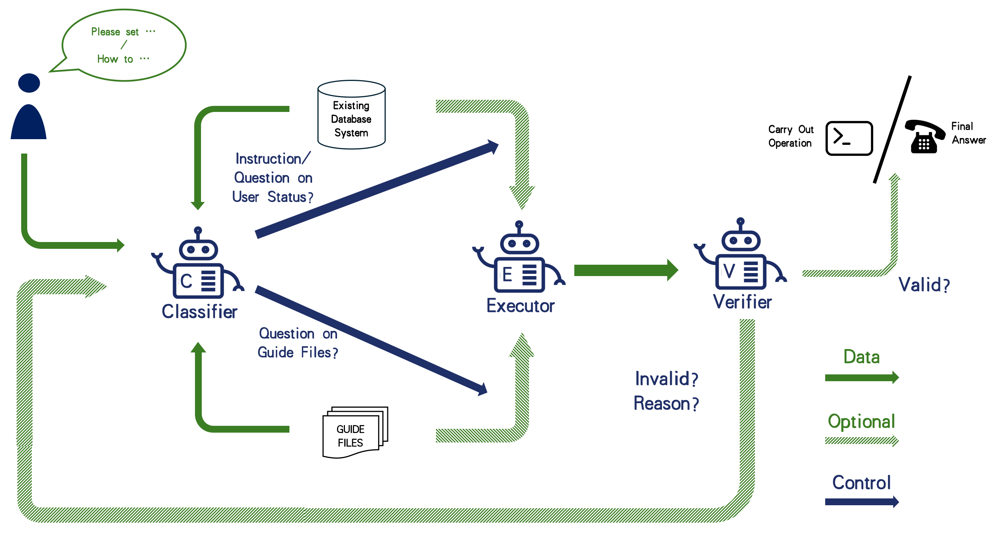
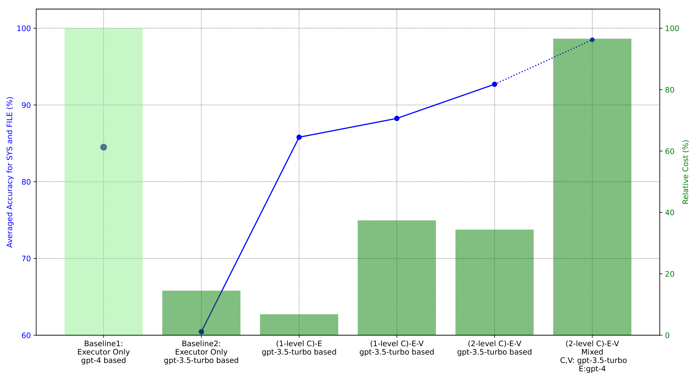

# CHOPS
Repository for the [[paper](https://arxiv.org/abs/2404.01343)]:

**CHOPS: CHat with custOmer Profile Systems for Customer Service with LLMs**

**Authors:** [Jingzhe Shi](mailto:shi-jz21@mails.tsinghua.edu.cn), [Jialuo Li](mailto:lijialuo21@mails.tsinghua.edu.cn), [Qinwei Ma](mailto:mqw21@mails.tsinghua.edu.cn), [Zaiwen Yang](mailto:yangzw23@mails.tsinghua.edu.cn), [Huan Ma](mailto:mah21@mails.tsinghua.edu.cn), [Lei Li](mailto:lilei@di.ku.dk).

**Abstract:** Businesses and software platforms are increasingly utilizing Large Language Models (LLMs) like GPT-3.5, GPT-4, GLM-3, and LLaMa-2 as chat assistants with file access or as reasoning agents for custom service. Current LLM-based customer service models exhibit limited integration with customer profiles and lack operational capabilities, while existing API integrations prioritize diversity over precision and error avoidance which are crucial in real-world scenarios for Customer Service. We propose an LLMs agent called **CHOPS** (**CH**at with cust**O**mer **P**rofile in existing **S**ystem) that: (1) efficiently utilizes existing databases or systems to access user information or interact with these systems based on existing guidance; (2) provides accurate and reasonable responses or executing required operations in the system while avoiding harmful operations; and (3) leverages the combination of small and large LLMs together to provide satisfying performance while having decent inference cost. We introduce a practical dataset, *CPHOS-dataset*, including a database, some guiding files, and QA pairs collected from *CPHOS*, which employs an online platform to facilitate the organization of simulated Physics Olympiads for high school teachers and students. We conduct extensive experiments to validate the performance of our proposed **CHOPS** architecture using the *CPHOS-dataset*, aiming to demonstrate how LLMs can enhance or serve as alternatives to human customer service.

<!--  -->


This repository includes:

1. Codes for the **CHOPS-architecture**.
2. The data desensitized *CPHOS-dataset*.
3. running logs.

# Dataset Configs

1. Database and corresponding apis.
	1. Database:
		1. Format: tables are stored in json format in this file in `prepare_datas\database`.
		2. Content:
			1. cmf_tp_admin: the table to record the admins
			2. cmf_tp_area: the table to record the areas of schools
			3. cmf_tp_correct: the table to record the situations of every single problem and question
			4. cmf_tp_exam: the table to record exam status
			5. cmf_tp_member: the table of all users (team_leader, vice team_leader, arbiter)
			6. cmf_tp_school: the table of all schools
			7. cm_tp_student: the table of all students
			8. cmf_tp_subject: the table to record every single answer sheet and its grades, etc.
			9. cmf_tp_test_paper: the table to record every single test paper
		3. provided scripts:
			1. `deal_with_*.py`: our script to run data desensitization. i.e. nicknames, names, school names are desensitized by using part of their hash value.
			2. `add_to_database.py`: to add these tables into local MySQL database.
	2. Apis:
		1. Format: python wrapped SQL commands, with exception checks. At `db_api`.
		2. Content:
			1. `db_api/DataManagingApis`
			2. `db_api/DataQueryApis`
		3. Description of the used Apis: see `guidefiles/executable_operations.txt`.
2. Guide Files
	1. Format: user guide and common questions are in pdf format in `guidefiles`.
3. Guide File related QAs and System related Queries and Instructions
	1. Format: csv files at `QAs`.
	2. system query or instructions: at `QAs\instructions_augmented.csv`.
	3. guide file or basic information based QAs: at `QAs\newQAs.csv`.

# Run the codes

## Installation

### Step 1. Install MySQL

install from [MySQL](https://www.mysql.com/).

### Step 2. Install python environments

python 3.8 is needed. requirements can be found in requirements.txt

(windows platform is recommended because of encoding issues for `.json` and `.csv` files)

### Step 3. Initialize Database

Please log into your MySQL then run:

```mysql
create database CPHOS_dataset_2;
```

Then, please run the python script to add tables into the database: (remember to modify the PASSWORD of your own MySQL database in `add_to_database.py` to accomodate local environment).

```bash
python prepare_datas\database\add_to_database.py
```

You also need to modify the 5th line in `db_api\dbinformation.txt` to your own MySQL password.

## Run Experiments

### Step 1. Add your own tokens

Modify the tokens for GPT, GLM and LLaMa to your own tokens to `tokens.py`. You may leave the token of unused LLMs unmodified, since they (or it) will not be used. This is related to the setting of configs in `configs.py`, where we will introduce below.

### Step 2. Adjust the config file

The config file is at `configs.py`. This file is related to configurations of experiments for (1-level C)-E, (2-level C)-E, (1-level C)-E-V and (2-level C)-E-V. Adjust `EXP`, `LOG_DIR` and `TAG` to your own tag.

1. Modify `DATA` between `instructions_augmented` and `newQAs` to switch between system-related queries \& instructions and guidfile-based queries.
2. Modify configuration for each agent (Classifier, Executor, Verifier). Please refer to the config file for more details as the config itself is easy to understand

### Step 3. Run

Run the following command:

```bash
python test.py
```

then the experiment will start.

### Step 4. view running results

The .csv files generated are at `result` by default and the place to save can be modified in `configs.py`.

Please refine the auto-checked results by human to avoid inaccuracy for accuracy caused by auto-checking.

The input and output `.txt` files can be found in the `log_*` dir by default which can be modified in `configs.py`. To count the characters please run `character_counting.py` with the parameters in it modified.

### (Optional) Step 5. Run Executor Only Experiments

The configs and experiment entrance for running executor only is written separately in `configs_executor_only.py` and `test_Eonly.py`.

Please modify the configs in `configs_executor_only.py` in the same method as described above, then run:

```bash
python test_Eonly.py
```

to run this experiment.


We provide all .csv result files and .txt log files can be found in `result` dir and `log_*` dir.

# Results Measured



Please refer to the [[paper](https://arxiv.org/abs/2404.01343)] for more details.
